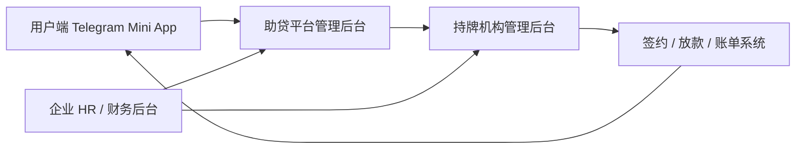
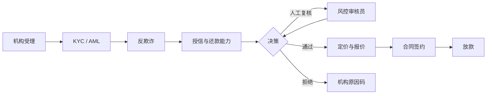

# 三方管理后台与风控规划

## 1. 总体边界

| 后台             | 业务所有者 | 有权决定                                                | 无权决定                                      |
| ---------------- | ---------- | ------------------------------------------------------- | --------------------------------------------- |
| 助贷平台管理后台 | 助贷公司   | 资料是否完整、企业接入、运营分流、补件、客服协同        | 信贷批准/拒绝、额度、利率、放款、逾期处置策略 |
| 持牌机构管理后台 | 持牌机构   | KYC/反欺诈/授信、额度、定价、合同、放款、账单、贷后策略 | 修改企业出具的原始核验结果                    |
| 企业 HR/财务后台 | 签约企业   | 仅在用户授权范围内核验在职、薪资结论和员工信息异议      | 信贷决策、查看其他企业或无授权用户的信贷数据  |

## 2. 助贷平台管理后台

### 页面与功能

| 模块         | 核心能力                                             | 关键控制                           |
| ------------ | ---------------------------------------------------- | ---------------------------------- |
| 申请运营队列 | 待补件、待资料审核、待企业核验、待机构回传、异常申请 | 不能录入或修改机构审批结论         |
| 资料审核     | 检查身份证照片清晰度、证件/银行卡格式、资料一致性    | 高敏资料脱敏；查看原件需理由与审计 |
| 企业管理     | 企业准入、管理员、数据字段配置、核验 SLA             | 企业数据按租户隔离                 |
| 机构协作     | 路由规则、接口健康度、申请推送、回调异常             | 路由只基于机构批准的产品和客群规则 |
| 客服与投诉   | 用户工单、补件通知、状态解释、机构转办               | 不展示或承诺最终授信结果           |
| 对账运营     | 接收放款/账单状态、差异工单、日结检查                | 以机构/通道流水为准，禁止手工改账  |
| 合规审计     | 授权记录、原件访问、权限变更、数据导出               | 只读、不可篡改日志                 |

### 角色

| 角色       | 权限                                     |
| ---------- | ---------------------------------------- |
| 资料审核员 | 看分配的脱敏申请，发起补件，提交审核意见 |
| 复核主管   | 审核敏感变更、复核异常资料、分配队列     |
| 企业运营   | 管理企业资料和核验 SLA，不看证件原件     |
| 机构运营   | 处理接口与回调异常，不可改机构结论       |
| 财务运营   | 查看对账与差异，不能修改账单             |
| 合规审计员 | 只读审计、导出审批、异常调查             |

## 3. 持牌机构管理后台（信贷中台）

### 模块

| 模块         | 功能                                                       | 产出                           |
| ------------ | ---------------------------------------------------------- | ------------------------------ |
| 申请受理     | 接收助贷推送、校验请求签名/幂等/资料完整性                 | 机构申请号、受理状态           |
| KYC 与反洗钱 | 实名认证、名单筛查、设备/账户核验、人工复审                | KYC/AML 结论与原因码           |
| 反欺诈       | 设备、身份、银行卡、申请行为、关联关系、黑名单等规则与模型 | 风险分、命中规则、人工复核任务 |
| 授信风控     | 准入、还款能力、额度、期限、产品适配                       | 批准/拒绝/人工复核、额度、期限 |
| 定价与费用   | 利率、机构费用、适用税费、APR、还款计划                    | 不可变 `offer_snapshot`        |
| 合同与签约   | 合同模板、披露、签约、签约存证                             | 合同号、签约状态、合同版本     |
| 放款与账务   | 绑卡核验、放款指令、账单、还款、冲正                       | 放款流水、账单、还款状态       |
| 贷后风险     | 逾期分层、提醒、外包协作、投诉/争议处理                    | 贷后任务、处置记录、合规报表   |
| 组合风险     | 产品/渠道/企业/地区维度的额度与风险监控                    | 风险限额、预警、暂停策略       |

### 风控决策流水

### 风控治理要求

1. **规则与模型版本化**：每个决策记录规则集、模型版本、输入摘要、输出、操作人及时间，保证可回放。
2. **人机分离**：策略配置人、模型发布人、人工审核人、放款复核人不得由同一角色在同一案件中兼任。
3. **解释与申诉**：向助贷平台回传可对外使用的原因码；内部策略细节不直接暴露给运营端。
4. **公平性与质量监控**：监测命中率、通过率、人工复核率、欺诈损失、早期逾期和渠道/企业偏差；异常时暂停策略或降级到人工审核。
5. **额度与集中度**：按产品、助贷渠道、企业、地区、期限设置限额；超限自动停止新申请推送并告警。

## 4. 企业侧管理后台（HR / 财务）

### 页面与功能

| 模块     | HR 能力                                  | 财务能力                              |
| -------- | ---------------------------------------- | ------------------------------------- |
| 企业概览 | 核验待办、SLA、员工异议                  | 核验统计、结算/对账（若合作模式需要） |
| 员工核验 | 在职状态、入职日期、薪资区间或发薪结论   | 复核发薪结论、批量导入                |
| 批量工具 | 下载模板、导入、字段映射、错误报告       | 导入审批、数据源对接管理              |
| 授权中心 | 查看每名员工的授权范围、有效期、撤回状态 | 查看数据使用记录                      |
| 异议处理 | 员工更正请求、核验退回、备注             | 高风险核验的二次确认                  |
| 管理设置 | HR 管理员、核验员分配                    | 财务管理员、导入权限、报表权限        |

### 企业端数据原则

- 默认只展示员工已授权的字段及核验任务，不能查看贷款额度、利率、还款、逾期或机构风控结论。
- 薪资优先由“金额区间”或“核验结论”呈现；完整工资单仅在授权、必要性和保留规则均满足时使用。
- 批量导入采用加密传输、字段模板校验、逐行错误反馈；文件到期自动清理，导入结果保留审计摘要。
- 管理员、核验员和财务角色分离；企业管理员变更、导出和大批量核验须二次确认。

## 5. 跨后台协同状态

| 事件          | 助贷平台               | 持牌机构         | 企业端         |
| ------------- | ---------------------- | ---------------- | -------------- |
| 用户提交      | 创建申请与资料审核任务 | 未受理           | 无任务         |
| 资料完整      | 发起企业核验           | 可预受理         | 出现核验待办   |
| 企业核验通过  | 推送机构申请           | KYC/风控中       | 任务完成       |
| 机构审批通过  | 展示报价并通知用户     | 生成报价/合同    | 不可见信贷结论 |
| 用户签约      | 等待放款回调           | 指令放款         | 无任务         |
| 账单/还款变化 | 同步展示、通知、对账   | 更新账务权威记录 | 无任务         |

## 6. 统一权限、安全与审计

- 三个后台使用独立租户、独立角色域和最小权限；跨域访问通过受控 API，不共享数据库读权限。
- 所有敏感操作使用 MFA、短时会话、设备/IP 风险控制；原件查看、下载、导出、银行卡变更必须审计。
- 机构后台输出给助贷平台的数据使用“对外状态/原因码”字段，内部风控特征、模型分数、反欺诈命中详情不外泄。
- 所有管理端写操作携带请求 ID、操作者、角色、前后值、用途、审批/复核人和时间；审计日志不可由业务管理员删除。
- 数据保留、跨境传输、费用披露、催收与投诉等规则必须由实际展业地的持牌机构与法务合规团队确认。

## 7. 推荐交付顺序

1. 助贷后台：申请队列、资料审核、企业管理、机构回调异常、审计。
2. 企业后台：授权核验待办、单笔核验、批量导入、管理员权限。
3. 机构后台：机构受理、人工审核、报价快照、合同/放款/账单回调。
4. 风控中台：规则版本、人工复核、策略审批、限额与组合风险看板。
5. 财务与贷后：账单对账、差异工单、投诉协同、合规报表。
