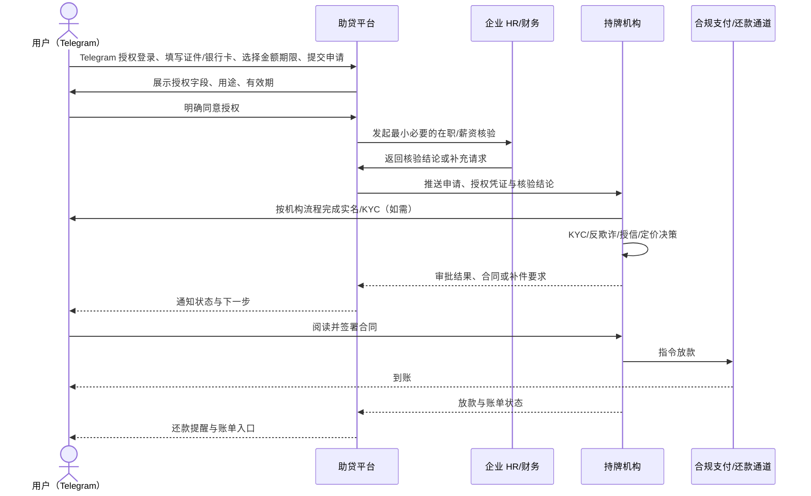
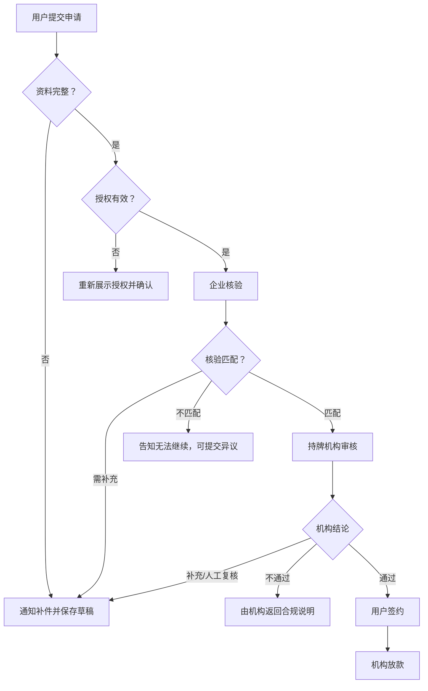

# 薪资贷业务流程

## 端到端流程

## 异常分流

## 数据最小化清单

| 数据类别 | 推荐字段                                             | 数据接收方                           | 目的             |
| -------- | ---------------------------------------------------- | ------------------------------------ | ---------------- |
| 身份资料 | 身份证号码、身份证正反面、姓名（前端及后台脱敏展示） | 持牌机构；助贷方按授权辅助采集       | KYC、签约        |
| 收款资料 | 本人银行卡号、开户行/卡类型（脱敏展示）              | 持牌机构及合规支付通道               | 绑卡、放款、还款 |
| 企业核验 | 企业 ID、在职状态、入职月、薪资区间、核验时间        | 持牌机构；助贷方仅留流程所需结果     | 贷前核验         |
| 账务状态 | 账单状态、应还日期、金额区间                         | 用户、持牌机构；助贷方按权限用于提醒 | 贷后服务         |

不采集或不默认共享：通讯录、Telegram 聊天内容、与身份核验无关的相册内容、精确位置、完整工资流水、与申请无关的家庭成员数据。
