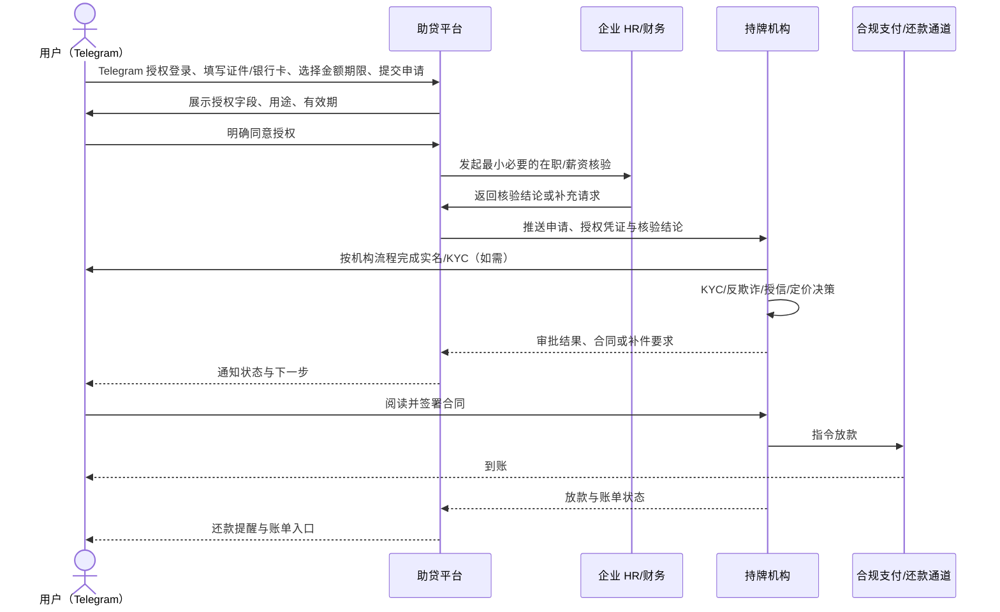
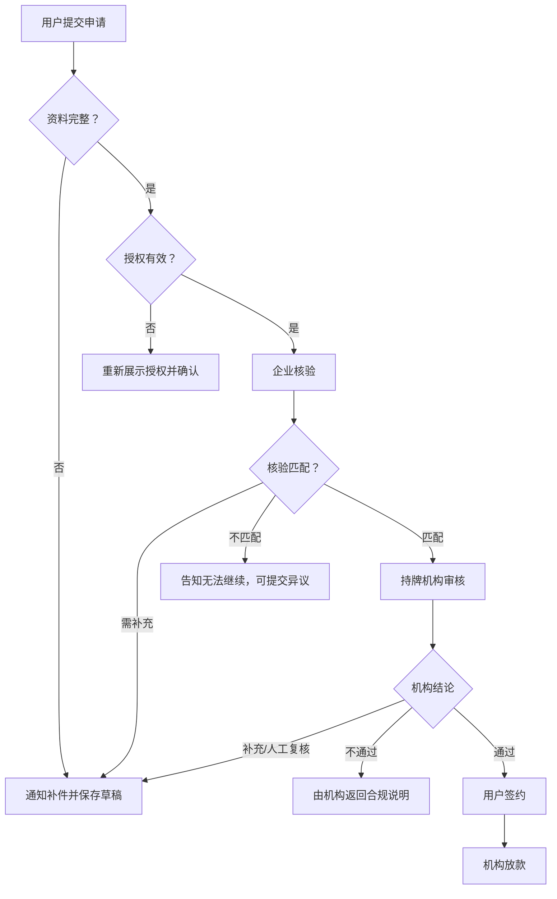

# 薪资贷业务流程

## 端到端流程

## 异常分流

## V1 补充：发薪节点还款、提醒与人工核销

> 本节为当前 V1 的执行规则，优先于本文前述通用流程中的“合规支付/还款通道”表述。V1 不启用银行自动代扣；企业按受控导出清单人工执行**本金**扣款，用户向持牌指定账户支付利息，持牌机构独立确认核销。

### 还款计划与发薪节点

1. 每个工厂由 KhmerX 平台管理员在企业资料中配置 1 或 2 个**可选工资发放日期**；每个选项为具体日（1–28）或“月末”，例如 10 日、15 日/月末、10 日/25 日。不得假定所有工厂相同。
2. 还款计划严格以实际 `disbursedAt` 后的工厂有效发薪节点生成：用户在签约前选择一次还清（下一合格节点）或两次还清（连续两个节点）。每期仅分配本金；节点日期、每期本金、实际计费天数、规则版本与工厂发薪节点版本必须一并冻结在报价和合同快照中，前端或企业端不得自行计算或改写。
3. 企业执行端只接收：企业内部员工引用、工资日、应扣本金、已扣/部分扣/未扣、凭证引用、差异原因；不得显示利息、居间服务费、额度、合同、征信或持牌机构内部资料。利息由用户向持牌指定账户支付。
4. 企业回填“已扣”不等于结清。持牌机构必须独立核对到账与凭证后，才可将贷款标记为 `PAID_OFF`；部分扣或未扣进入人工异常处理。

### 三轮提醒与宽限期

对所有存在待还本金的用户，系统按**每一个到期/工资扣款节点**生成不可重复的通知任务：

| 时点               | 必须通知内容                                       | V1 执行方             |
| ------------------ | -------------------------------------------------- | --------------------- |
| 到期前 3 天（T-3） | 本期应还本金、日期、人工扣款/手动处理说明          | KhmerX 通知与客服投影 |
| 到期前 1 天（T-1） | 同上，并提示核对工资/账户安排                      | KhmerX 通知与客服投影 |
| 到期当日（T）      | 应还本金、企业执行状态或人工处理入口、宽限期截止日 | KhmerX 通知与客服投影 |

1. 每个节点均适用“实际工资发放日后 3 个自然日宽限期”；是否计收违约成本、节假日顺延及最终逾期定义必须由持牌机构与当地法务在上线前冻结。未冻结前，系统只能展示“处理中/请联系支持”，不得自行计算罚息或宣称免罚。
2. 宽限期结束后的案件进入 `COLLECTION_EXCEPTION` 或持牌机构定义的贷后状态；KhmerX 客服只可解释事实与流程，不可修改额度、利息、合同、核销或催收结论。
3. 提醒语必须提供高棉语、英语、中文版本；不得包含完整证件号、完整银行卡号、内部评分或持牌机构风控原因。

### 审查输入边界

- 企业 HR/财务可在授权和租户边界内提供定期员工花名册（工号、姓名、加密证件匹配值、入职时间、在职状态）以及经授权的工资、发薪节点与状态变更，用于真实性核验和工资扣款执行；企业不得决定授信、定价、放款或核销。
- 持牌机构应将征信/已有负债与可偿债现金流作为独立审查输入；KhmerX 不接收、不展示其征信报告、模型分数或内部规则。
- 银行自动代扣、短信通道、银行接口失败重试等均为后续能力，需独立授权、支付接口、合同条款与法务确认后才可启用；不得在 V1 文案中暗示已经开通。

### 放款后融资居间服务费

1. 服务费仅在持牌机构确认实际放款成功后产生，不是放款前置条件，也不得阻止持牌机构放款。
2. 适用月费率按“工厂有效版本优先、平台默认版本兜底”确定；订单必须冻结适用费率、来源、规则版本、计费天数和应付金额。
3. 自 `disbursedAt` 起在 D+1、D+2、D+3 发送三语提醒，D+3 为最晚支付日；由用户向 KhmerX 指定账户支付并经助贷财务双人复核。

## 数据最小化清单

| 数据类别 | 推荐字段                                             | 数据接收方                           | 目的             |
| -------- | ---------------------------------------------------- | ------------------------------------ | ---------------- |
| 身份资料 | 身份证号码、身份证正反面、姓名（前端及后台脱敏展示） | 持牌机构；助贷方按授权辅助采集       | KYC、签约        |
| 收款资料 | 本人银行卡号、开户行/卡类型（脱敏展示）              | 持牌机构及合规支付通道               | 绑卡、放款、还款 |
| 企业核验 | 企业 ID、在职状态、入职月、薪资区间、核验时间        | 持牌机构；助贷方仅留流程所需结果     | 贷前核验         |
| 账务状态 | 账单状态、应还日期、金额区间                         | 用户、持牌机构；助贷方按权限用于提醒 | 贷后服务         |

不采集或不默认共享：通讯录、Telegram 聊天内容、与身份核验无关的相册内容、精确位置、完整工资流水、与申请无关的家庭成员数据。
