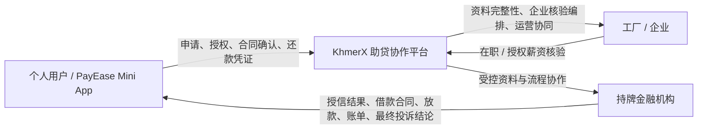

# KhmerX 平台理念与统一叙事

**版本：** V1.0
**适用对象：** 内部团队、投资人、合作金融机构、合作工厂 / 企业
**首站市场：** 柬埔寨
**对外语言：** 高棉语、英语、中文

## 1. KhmerX 是什么

KhmerX 是一个面向柬埔寨的**数字商业与金融协作平台**。它不以“单一贷款产品”定义自己，而是用可信的数字流程连接个人、企业与持牌金融机构，让原本分散、纸质、难以追踪的金融协作变得可验证、可管理、可审计。

KhmerX 希望响应并支持柬埔寨数字经济的发展方向：通过本地化、多语言、可访问的数字产品，降低个人、企业和金融机构之间的协作成本，推动更多业务流程从线下、分散和不透明，走向更高效、可追溯、可持续的数字化服务。

首个落地场景是工厂员工薪资贷协作：员工在 PayEase Mini App 内提交申请和资料；KhmerX 协调资料完整性与企业核验；接入的持牌金融机构独立完成授信、合同、放款、催收及最终投诉处理。

**一句话定位：**

> KhmerX 让个人、企业与金融机构在合规边界内高效协作。

### 1.1 名称含义

| 名称元素 | 含义                                                                                                                                                                                                 |
| -------- | ---------------------------------------------------------------------------------------------------------------------------------------------------------------------------------------------------- |
| `Khmer`  | 指向柬埔寨、本地用户、本地企业与本地数字服务。它强调产品首先服务柬埔寨市场，并以高棉语、英语、中文建立可理解的使用体验。柬埔寨已有如 Khmer24 等成功本地数字品牌，也说明“Khmer”具有明确的本地识别度。 |
| `X`      | 代表开放、延展与连接。它不把 KhmerX 限定为单一薪资贷产品，而是承载多个受控、合规、可复用的金融与商业协作场景。                                                                                       |

`X` 所代表的未来可能包括薪资贷、个人信用贷、企业贷、消费分期、购物贷及其他数字商业协作产品；这些均属于路线图方向，不代表现阶段已经提供或对外承诺上线。

> 对外沟通时，KhmerX 可以说明自己“支持柬埔寨数字经济发展”；不得暗示已获得政府、监管机构或任何公共机构的官方背书、授权或合作，除非届时确有书面依据。

## 2. 品牌架构

```text
KhmerX                              集团 / 平台主品牌
├─ PayEase · by KhmerX              个人用户金融产品（To-P）
├─ KhmerX Enterprise                工厂 / 企业协作产品（To-B）
├─ KhmerX Partner                   持牌机构与合作方门户（To-B）
└─ KhmerX Core                      平台共用能力
```

| 品牌 / 模块       | 服务对象     | V1 角色                                              |
| ----------------- | ------------ | ---------------------------------------------------- |
| KhmerX            | 整个平台生态 | 信任、协作、数据治理与运营品牌                       |
| PayEase           | 个人用户     | 薪资贷申请、审核进度、合同、账单、还款与客服入口     |
| KhmerX Enterprise | 工厂 / 企业  | 员工核验、待办、企业协作、后续结算能力               |
| KhmerX Partner    | 持牌机构     | 审核、额度、定价、合同、放款、核销、投诉与审计协同   |
| KhmerX Core       | 全部产品     | 多语言、多租户、身份、授权、RBAC、审计、通知、连接器 |

PayEase 是 KhmerX 面向个人的产品，不替代 KhmerX 平台品牌；个人端统一使用 `PayEase · by KhmerX`。

## 3. V1 的商业与责任边界

### 3.1 三方协作模型



### 3.2 责任划分

| 主体             | 负责                                                                                         | 不负责                                                             |
| ---------------- | -------------------------------------------------------------------------------------------- | ------------------------------------------------------------------ |
| KhmerX / PayEase | 获客、用户体验、资料完整性、企业核验编排、服务协议、手续服务费披露与收取、客服协同、审计协作 | 最终授信、利率定价、借款合同主体、放款决定、催收决定、最终投诉裁决 |
| 工厂 / 企业      | 经员工授权后的在职 / 薪资相关核验、HR 待办处理                                               | 授信、费用、合同、放款、查看其他租户或用户敏感信息                 |
| 持牌金融机构     | KYC / AML、信用审批、额度、定价、借款合同、放款、账单、贷后、催收与最终投诉                  | 直接越权访问未授权的企业或平台数据                                 |

> **重要口径：** KhmerX 在 V1 是助贷协作平台，不是借款合同中的持牌放款主体。任何未来牌照、资金或业务模式调整，必须经法务、合规、合同和系统架构重新确认后再修改本口径。

### 3.3 手续服务费原则

- 服务对象：个人用户。
- 默认规则：按月 10.5%，15 天按比例示例为 5.25%，由后台版本化配置并在签署前清晰展示。
- 服务费从放款金额中扣除时，必须同屏展示：批准金额、利息、服务费、实际到账金额、到期应还金额、期限和合同版本。
- 不得静默扣减、隐藏收费项目或用营销表述弱化用户应还义务。
- 具体合规性、披露方式、税务和收费边界以柬埔寨当地法务确认与持牌机构协议为准。

## 4. V1 的核心承诺

KhmerX V1 不承诺“人人可借”或“快速获批”，而承诺以下五件事：

1. **流程清楚**：用户知道现在处于申请、企业核验、审核、签约、放款或还款的哪一步。
2. **费用透明**：最终确认前展示批准金额、服务费、利息、实际到账和应还金额。
3. **资料最小化**：只为合法业务目的采集资料；身份、联系人、收款账户与文件加密并最小授权访问。
4. **权责分明**：企业只核验员工信息；KhmerX 协作运营；持牌机构独立作出金融决定。
5. **过程可追溯**：申请、审批、合同、放款、核销、投诉和人工调整均保留审计链路。

## 5. 当前产品：PayEase 薪资贷协作

### 5.1 用户闭环

```text
Telegram 登录
→ KYC 与选择企业
→ 服务协议 + 数据 / 企业核验授权
→ 提交申请
→ KhmerX 资料完整性审核
→ 企业 HR 核验
→ 持牌机构审核额度
→ 用户查看报价
→ 借款合同签署
→ 双人审批下的人工放款
→ 账单、还款凭证、人工核销与对账
```

### 5.2 当前产品规则

- 申请金额：USD 10–500。
- 期限：15 天、30 天。
- 初始产品规则可配置；费率、服务费、合同模板、计算基数、舍入规则均须版本化。
- 允许再次申请的条件由产品规则与持牌机构审批策略决定；进行中订单默认不可重复提交。
- 多笔资格不以公开标签判断，而按持牌机构批准的未结清本金总额上限控制。

## 6. 平台能力：KhmerX Core

KhmerX 的长期价值不只是一个界面，而是可复用的协作底座：

| 能力         | 作用                                                             |
| ------------ | ---------------------------------------------------------------- |
| 多语言       | 高棉语、英语、中文；用户选择后持续保存偏好                       |
| 多租户       | 一座工厂对应一个企业租户；企业数据严格隔离                       |
| 身份与授权   | Telegram 服务端验签、多 Bot 弹性、会话防重放、协议版本与授权记录 |
| RBAC 与组织  | 部门—角色—账号—字段范围；默认拒绝与可审计授权                    |
| 审批工作流   | 经办 / 复核分离，支持产品与金额阈值策略版本化                    |
| 数据治理     | 加密、脱敏、最小化、访问审计、留存与未来数据权利机制             |
| 账务与对账   | 放款、账单、核销、差异工单与不可篡改审计事件                     |
| 多机构连接器 | 在受控 API、签名、幂等、重试和隔离框架下接入多家持牌机构         |

## 7. 服务对象价值

### 7.1 对个人用户

- 在熟悉的 Telegram 场景中完成受控申请与进度查询。
- 看到完整且可行动的审核、报价、合同、到账和还款信息。
- 获得高棉语、英语、中文服务入口，以及明确的客服 / 投诉路径。

### 7.2 对工厂 / 企业

- 减少散乱的人工作业，集中处理本企业员工核验待办。
- 不需要参与授信、收费、合同或催收，减少不必要的业务与数据风险。
- 后续可延展员工福利金融、对账、结算和企业服务协同。

### 7.3 对持牌金融机构

- 获得结构化、经授权的获客与企业核验协作流程。
- 保持对 KYC、风控、授信、定价、合同、放款和贷后的独立控制权。
- 接入可审计的审批、合同、账单、对账与投诉协同能力。

### 7.4 对 KhmerX

- 通过可复用的身份、租户、审批、数据治理与连接器能力，降低新场景的重复建设成本。
- 在不替代持牌金融机构核心职责的边界内，构建长期可信协作网络。

## 8. 发展路线图（非当前商业承诺）

以下是能力延展方向，不构成当前任何产品、额度、收益或上线时间承诺：

```text
阶段 1：工厂员工薪资贷协作（当前 V1）
阶段 2：个人现金流服务与消费分期
阶段 3：企业员工福利金融协同
阶段 4：企业 / 供应商 / 商户融资申请协作
阶段 5：多持牌机构连接器与更广泛的数字商业协作
```

每进入一个新场景，须重新完成：主体与牌照边界、产品规则、数据最小化、合同 / 授权、资金与对账、投诉责任、技术隔离和上线验收。

## 9. 对外沟通原则

### 可以说

- `KhmerX connects people, enterprises and licensed financial institutions through trusted digital workflows.`
- `PayEase is KhmerX's personal financial product for application, progress tracking, contracts and repayment support.`
- `Final lending decisions and loan terms are independently determined by licensed financial institutions.`
- `额度、费用与合同条款将在确认前清晰展示。`

### 不可以说

- `KhmerX guarantees approval / instant funding / lowest rate.`
- `KhmerX is the lender`（除非未来具备并使用相应主体与牌照，且完成新的法律确认）。
- `企业会决定你的额度`。
- 任何未经法务确认的“合规”“最低成本”“官方担保”“零风险”表述。

## 10. 内部决策准则

当出现产品、合作、技术或运营决策时，按以下顺序判断：

1. 是否清楚区分平台协作责任与持牌金融决定？
2. 是否让用户在确认前看清金额、费用、合同和下一步？
3. 是否只使用完成该流程所需的最少数据？
4. 是否做到企业租户隔离、角色最小权限、经办复核分离与可审计？
5. 是否能在高棉语、英语、中文中准确说明，而不是依赖误导性营销？
6. 是否为未来复用能力而设计，同时不把未来路线图误写成今天的承诺？

如果任何一项答案是否定的，方案不得进入上线实施。
