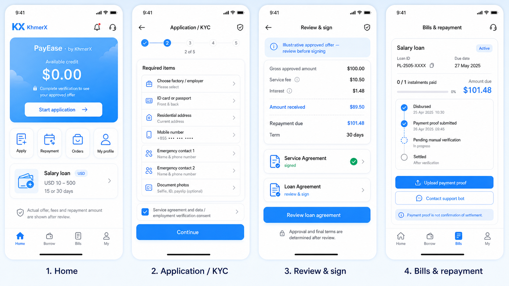
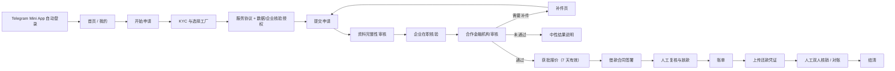
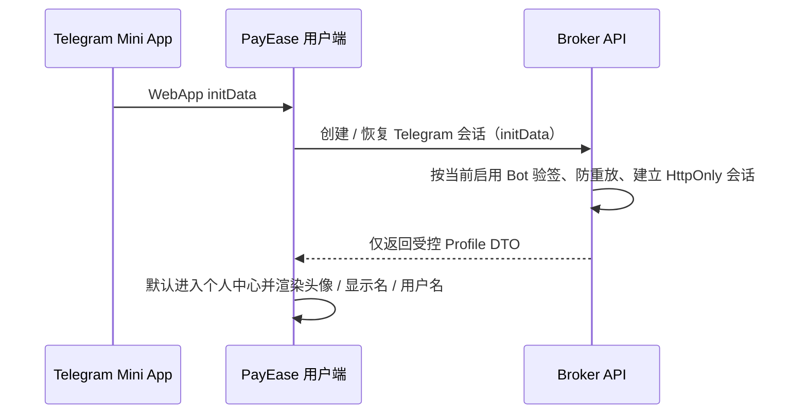

# KhmerX × PayEase V1 全流程 UI / UX 开发总规

> **用途**：交给 Trae 实现用户端 UI；本文件是视觉、页面、状态和交互的唯一执行基线。
> **优先级**：本文件优先于 `docs/02-品牌与官网/TRAE_KHMERX_PAYEASE_UI_REFRESH.md` 中与本文件冲突的首页、期限、流程描述。
> **边界**：只实现演示 / 前端交互和已有后端接口适配；不得伪造登录、额度、放款、还款成功或接入未获准的银行、HRIS、支付接口。



## 1. 品牌与产品定位

```text
KhmerX                         平台主品牌
└─ PayEase · by KhmerX         面向个人的薪资贷产品
```

- 顶部品牌固定为 `KhmerX` + `PayEase · by KhmerX`；不可将 PayEase 表述为持牌放款方。
- 页面文案避免反复出现“助贷公司”“持牌机构”和公司名。可用中性表达：`审核团队`、`合作金融机构`、`审核结果`。
- V1 可申请金额：`USD 10–500`；期限只允许：`15 天`、`30 天`。
- 不得出现：`低利率`、`秒到账`、`保证获批`、`无条件`、`零门槛`。

## 2. 全局视觉 Token

| Token                 |        值 | 用途                     |
| --------------------- | --------: | ------------------------ |
| `--kx-primary`        | `#4096FF` | 主按钮、选中态、关键金额 |
| `--kx-primary-strong` | `#1677FF` | 按压/重点 CTA            |
| `--kx-card-start`     | `#57A8FF` | 额度卡渐变起点           |
| `--kx-card-end`       | `#4096FF` | 额度卡渐变终点           |
| `--kx-bg`             | `#F5F7FA` | 页面背景                 |
| `--kx-surface`        | `#FFFFFF` | 卡片、底栏               |
| `--kx-text`           | `#1D2129` | 主文字                   |
| `--kx-muted`          | `#86909C` | 辅助与合规说明           |
| `--kx-warning`        | `#F7BA1E` | 待补件、提示             |
| `--kx-danger`         | `#F53F3F` | 失败、逾期，仅表达状态   |
| `--kx-success`        | `#00B42A` | 已完成、已核销           |

- 设计基准：`375 × 667`，同时适配 Telegram WebView、Android / iOS 与安全区。
- 左右间距 `16px`；模块间距 `20px`；大卡片 `16px` 圆角；按钮 `12px` 圆角。
- 金额 `32px/700`；页面标题 `20px/700`；卡片标题 `16px/600`；正文 `14px`；合规文字 `11px`。
- 使用 KhmerX Logo 资源；Header 中使用裁切图形或图形 + `KhmerX`，不要展示 `BUY · SELL · TRADE` 标语。
- 必须支持浅色 / 深色；深色模式不得只反色，文字对比度需可读。

## 3. 信息架构与导航

底部四个一级 Tab，固定显示并保留 `safe-area-inset-bottom`：

```text
首页 Home       借款 Borrow        账单 Bills        我的 My
```

| Tab  | 页面职责                                             | 不能做什么                                   |
| ---- | ---------------------------------------------------- | -------------------------------------------- |
| 首页 | 总览、申请入口、状态提醒、帮助                       | 不直接显示未审批的“可借额度”                 |
| 借款 | 申请草稿、KYC、授权、提交、审核进度、获批报价、签约  | 不得把服务协议和借款合同混为一份             |
| 账单 | 已放款订单、还款计划、人工还款凭证、核销状态         | 上传凭证后不得显示“已结清”                   |
| 我的 | Telegram 受控资料、语言、手机号状态、工厂、客服/投诉 | 不展示 Telegram ID、证件号、工资、全银行卡号 |

### 3.1 页面路由清单

| ID   | 页面            | 入口                | 主操作                         |
| ---- | --------------- | ------------------- | ------------------------------ |
| U-01 | 首页            | Home Tab            | 开始申请 / 快捷入口            |
| U-02 | 借款概览        | Borrow Tab          | 恢复草稿、查看进度、开始新申请 |
| U-03 | KYC 第 1–5 步   | U-02                | 保存草稿、下一步、返回         |
| U-04 | 服务协议与授权  | KYC 结束            | 阅读、确认、签署、继续         |
| U-05 | 提交确认        | U-04                | 确认提交、查看状态             |
| U-06 | 审核进度 / 补件 | 首页、U-02、订单    | 上传补件、联系客服             |
| U-07 | 获批报价        | 审核通过通知 / U-06 | 查看完整金额、继续签约或放弃   |
| U-08 | 借款合同签署    | U-07                | 阅读、电子确认、提交签署       |
| U-09 | 订单详情        | Orders / Bills      | 查看合同、放款、还款记录       |
| U-10 | 账单与人工还款  | Bills / U-09        | 查看应还、上传付款凭证         |
| U-11 | 个人中心        | My Tab              | 语言、手机号验证、客服 Bot     |
| U-12 | 客服 / 投诉     | U-11 / 任意帮助入口 | 打开 KhmerXBot，带最少上下文   |

## 4. 核心操作流



### 4.1 登录与语言

1. 在 Telegram 内，前端读取 WebApp 环境并把 `initData` 交给服务端验签；成功后自动进入 `我的`。已有进行中订单时，在顶部显示可点击状态卡。
2. 只展示服务端验签返回的头像、显示名、`@username`（如存在）。不得信任前端自己提交的头像、昵称或 Telegram ID。
3. 语言有 `km` / `en` / `zh-CN` 三种。选择后调用既有服务端偏好接口；下次登录使用上次选择。不得用 localStorage 存 token、initData、手机号、证件或合同。
4. 失败时显示中性提示：`无法确认本次 Telegram 会话，请从 PayEase Bot 重新打开。` 提供“重新打开说明”，不显示技术错误或 Bot 密钥信息。

### 4.2 申请与 KYC（U-03）

采用**五步向导**，每一步可保存草稿并在返回时保留经服务器保存的内容。

| 步骤         | 内容                                                       | 校验 / 交互                                        |
| ------------ | ---------------------------------------------------------- | -------------------------------------------------- |
| 1 基础资料   | 姓名、住址、手机号码                                       | 手机由 Telegram 联系人验证；不可要求读取通讯录     |
| 2 身份资料   | 身份证或护照二选一、证件正反面                             | 明确“加密保存，仅用于身份核验”；文件仅允许安全上传 |
| 3 紧急联系人 | 至少 2 位：姓名、电话、关系                                | 手工录入；无通讯录读取；显示联系人使用说明         |
| 4 企业与收款 | 选择关联工厂、银行、账号/卡号、持卡人姓名                  | 工厂为必选；账号输入掩码、变更后需重新确认         |
| 5 补充与确认 | 活体材料、可选财富/银行流水、申请金额 USD 10–500、15/30 天 | 可选材料不能阻断基础流程；提交前汇总核对           |

交互规则：

- 进度条显示 `第 n / 5 步`，不可假装提交已经成功。
- `继续` 按钮只有当前步必填项合格才可点击；禁用态需说明缺失项目。
- 离开未完成页面时，不弹夸张确认框；已保存草稿显示“已保存”。
- 金额传输使用 `{ amountMinor: string, currency: "USD" }`；前端不得引入金额 `number` DTO。

### 4.3 协议、审核与签约

#### A. 提交前：服务协议与授权（U-04）

- 分两张卡展示：`服务协议`、`数据与企业核验授权`。
- 每份协议含：标题、版本号、生效日期、阅读入口、确认框、签署时间；版本由后台配置，前端不硬编码正文。
- 电子确认方式仅调用获批的签约能力；OTP / Telegram 确认的法律有效性由合规配置决定。未配置时显示“暂不可提交”，不可绕过。

#### B. 审核进度（U-06）

状态时间轴只展示对用户可理解的状态：

```text
已提交 → 资料核对中 → 企业信息核验中 → 审核中 → 获批报价 / 需要补充 / 暂未通过
```

- `需要补充`：列出可行动项，如“请补充证件照片”“企业信息暂未匹配”；不暴露风控规则。
- `暂未通过`：展示中性说明与再次申请条件，不显示内部评分、规则、员工或企业审核人。
- 企业核验提醒由后台发给 KhmerXBot；用户端仅显示“核验处理中”，不得暴露企业 HR 姓名、手机号、审批记录。

#### C. 获批报价与借款合同（U-07/U-08）

报价页必须把金额拆开、同屏展示，禁止“静默扣减”：

| 字段     | 显示规则                                                   |
| -------- | ---------------------------------------------------------- |
| 批准金额 | `Gross approved amount`                                    |
| 借款期限 | `15 days` 或 `30 days`                                     |
| 年利息   | 默认 18% 年化，仅为后台可配置规则                          |
| 服务费   | 默认 10.5% / 30 天；15 天按 5.25% 示例，均由后台版本化配置 |
| 实际到账 | `批准金额 - 服务费`                                        |
| 到期应还 | `批准金额 + 利息`（以最终合同为准）                        |
| 有效期   | 默认 7 天，到期关闭后需重新申请                            |

- 页面顶端标记：`请在签署前确认所有金额与日期。`
- 第二份 `借款合同` 只能在获批报价后出现；呈现版本、完整条款、费用、到账金额、还款日、签署入口与下载/查看入口。
- 签署完成后显示“签署已提交，等待确认”，不得在未放款时显示“已放款”。

### 4.4 账单、还款与核销（U-09/U-10）

订单详情至少有四张信息卡：

1. **贷款摘要**：合同号脱敏、批准金额、实际到账、放款状态。
2. **还款计划**：放款成功日 + 15 / 30 自然日的应还日；节假日顺延规则以最终合同为准。
3. **还款记录**：已还 / 未还期数、金额、凭证审核状态。
4. **合同与帮助**：两份协议、客服 / 投诉 Bot。

人工还款流程：

```text
选择订单 → 查看应还金额与收款说明 → 上传付款凭证 → 待人工复核 → 已核销 / 驳回补充
```

- 凭证提交后固定显示：`付款凭证已提交，不代表已完成结清。`
- 显示状态：`待上传`、`待人工核验`、`需要补充`、`已核销`、`对账异常`。
- 不在前端显示银行卡完整号、内部对账差异原因、审核人员身份。

## 5. 首页（U-01）完整组件顺序

1. Header：KhmerX Logo、`PayEase · by KhmerX`、通知、客服。
2. 额度主卡：未获批为 `$0.00 USD`；提示“完成核验后可查看额度审核结果”；主按钮 `开始申请` 或 `查看申请进度`。
3. 快捷入口四宫格：`我要借款`、`还款管理`、`借款记录`、`额度提升`。
4. 单一产品卡：`PayEase 薪资贷`、`USD 10–500`、`15 / 30 天`、`立即申请`。
5. 帮助入口：`借款指南`、`安全防骗`。
6. 合规底文：`本服务由合作金融机构提供。请理性借贷，按时还款。`

## 6. 状态、空态与异常态

| 场景                 | UI 处理                                                    |
| -------------------- | ---------------------------------------------------------- |
| 无历史申请           | 我的页面显示“尚无申请”，CTA 去 `开始申请`                  |
| 有进行中申请         | 首页主 CTA 为“查看申请进度”，避免重复提交                  |
| 有已结清订单         | 借款 Tab 显示是否符合再申请条件；不能自动允许              |
| 优质客户             | 不显示“优质”标签；后台决定是否可多笔，按未结清本金总额限制 |
| 网络失败             | 保留本次可恢复表单状态，显示“请检查网络后重试”             |
| 上传失败             | 显示失败原因类别、重试；不丢弃已经安全保存的草稿           |
| 合同过期             | 显示“报价已过期，请重新提交申请”；不允许继续签署           |
| 未授权 Telegram 会话 | 清除前端展示态，跳转会话说明；不得循环请求                 |

## 7. 多语言规则

- 所有用户可见文案必须有 `zh-CN`、`en`、`km` key，禁止把中文硬编码在组件内。
- 高棉语必须经过母语审核后入生产；在未审核前使用已有已审核字典，不擅自机器翻译覆盖。
- 金额、日期、期限和合同版本均从结构化数据格式化，不拼接字符串。
- 语言切换不影响当前表单草稿、订单状态和会话。

## 8. 后台联动界面（仅交互要求）

| 角色端           | 只应收到                                                  | 禁止看到 / 操作                              |
| ---------------- | --------------------------------------------------------- | -------------------------------------------- |
| 助贷运营后台     | 资料完整性、补件、HR 催办、客服、投诉、异常工单、对账协同 | 授信、定价、放款决定                         |
| 企业 HR 后台     | 本工厂员工在职匹配、薪资核验结论                          | 证件、联系人、贷款合同、利率、账单、逾期信息 |
| 合作金融机构后台 | KYC 审核、额度、报价、合同、放款、账单、催收/投诉终责     | 跨租户企业数据、未经授权资料                 |

## 9. Trae 实现范围与红线

优先文件：

```text
user-mini-app/src/App.tsx
user-mini-app/src/pages/**
user-mini-app/src/components/**
user-mini-app/src/app.css
user-mini-app/src/i18n/**
user-mini-app/src/**/__tests__/**
```

绝对禁止：

- 不改 Telegram 服务端验签、HttpOnly Cookie、Bot 选择/多 Bot 恢复逻辑，除非另有专门后端任务。
- 不使用 `localStorage` / `sessionStorage` 保存 token、initData、手机号、证件、合同、银行卡信息。
- 不接入未签约的银行、支付、HRIS、KYC、活体或机构 SDK。
- 不把 mock 的“审批通过、付款成功、合同签署成功”作为真实生产结果。
- 不显示真实 PII、完整账号、原始证件、联系人详情给无权限人员。

## 10. Trae 分批任务与验收

### P0-A：导航与视觉系统

- [ ] 统一 Header、底部四 Tab、色彩 Token、浅/深色、KhmerX 品牌锁定。
- [ ] 首页按 §5 重建，清除旧的 7–180 天、1m/3m/6m 等陈旧界面。
- [ ] 所有 Tab 均能进入真实页面或明确的受控空态。

### P0-B：申请、审核、报价、签约 UI

- [ ] 实现 5 步 KYC UI、草稿/校验/安全掩码交互。
- [ ] 服务协议与借款合同为独立页面/组件。
- [ ] 实现审核时间线、补件、未通过、7 天报价过期与获批金额拆分展示。

### P0-C：账单与个人中心

- [ ] 实现账单、人工还款凭证、待核销 / 已核销 / 补件状态。
- [ ] 个人中心读取受控 Telegram 公开资料；语言偏好跨下次登录保留。
- [ ] 客服与投诉统一打开 KhmerXBot，不暴露内部处理信息。

### 验收命令

```powershell
pnpm --filter @payease/user-mini-app run typecheck
pnpm --filter @payease/user-mini-app run test
pnpm format:check
```

提交前由 Trae 提供：实际改动文件、`git diff --stat`、上述三项输出。不得提交构建产物、真实 Token、真实合同、截图中的 PII 或账号数据。

## 11. 五个快捷业务入口：完整 UI / UX 规格

> **产品判断**：`额度提升`不应设计成“一键提高额度”或保证提额的功能。V1 中它只能是“申请重新评估 / 补充资料”的入口，最终是否可用、金额多少均由合作金融机构审核决定。

### 11.1 我要借款（U-13）

**目标**：帮助用户以最低认知成本判断现在能否发起一笔申请，并进入正确的下一步，而不是重复创建申请。

#### 页面结构

1. 顶部：返回、标题 `我要借款`、客服入口。
2. `当前状态卡`：根据服务器返回状态，只显示下表中一个最优先动作。
3. `薪资贷产品卡`：USD 10–500、15 天 / 30 天、`申请条件与说明`入口。
4. `申请前准备`：身份资料、两位紧急联系人、所属工厂、收款账户；完成项显示绿色勾选，未完成项显示“去补充”。
5. 透明说明：`额度、费用和合同条款将在审核通过后完整展示。`

| 当前状态             | 主 CTA           | 次要内容                         |
| -------------------- | ---------------- | -------------------------------- |
| 无申请且符合基本条件 | `开始薪资贷申请` | 预计所需资料清单                 |
| 存在草稿             | `继续填写`       | 最近保存时间、`放弃草稿`二次确认 |
| 审核中 / 待企业核验  | `查看申请进度`   | 禁止再次提交                     |
| 已获批且报价有效     | `查看并签署合同` | 显示报价到期日                   |
| 已放款且不可多笔     | `查看当前账单`   | 不能出现“再借一笔”               |
| 已结清或允许多笔     | `申请新借款`     | 以后台 eligibility 结果为准      |
| 暂不符合再申请条件   | `查看说明`       | 可行动且中性的原因               |

#### 交互与状态

- 点击产品卡或 CTA 进入 U-14 `薪资贷申请`；若存在草稿则恢复对应步骤。
- “申请条件”用 Bottom Sheet 展示，不跳外部页；不得以“秒批”“低息”引导。
- 用户在审核中点击 CTA 时必须进入详情，而不是生成新的 application ID。
- 不展示“优质客户”内部标签；多笔资格只用 `当前可申请` / `暂不可申请` 表达。

### 11.2 还款管理（U-15）

**目标**：让用户准确知道应该还哪笔、何时还、金额多少、凭证提交后处于什么状态；V1 是人工核销，不伪造在线支付。

#### 页面结构

1. 顶部：`还款管理`、账单帮助入口。
2. `待处理账单`置顶卡：应还日、应还金额、状态色、`查看还款说明`。
3. `还款步骤`：
   `查看收款说明 → 完成线下付款 → 上传付款凭证 → 等待人工核验`。
4. `账单明细`：批准金额、已到账金额、利息、服务费、到期应还；每一项可点开“说明”。
5. `历史还款`：只显示日期、金额、状态、凭证状态，不展示银行完整账号或审核人。

#### 状态与操作

| 状态       | 视觉         | 用户操作                           |
| ---------- | ------------ | ---------------------------------- |
| 未到期     | 蓝灰信息卡   | 查看计划 / 提前咨询客服            |
| 即将到期   | 黄色提示卡   | 查看说明、上传凭证                 |
| 已逾期     | 红色状态卡   | 联系客服、上传凭证；不使用恐吓文案 |
| 凭证待核验 | 蓝色进行中卡 | 查看已提交凭证、联系客服           |
| 凭证需补充 | 黄色状态卡   | 重新上传 / 补充说明                |
| 已核销     | 绿色卡       | 查看还款记录                       |
| 对账异常   | 黄色状态卡   | 客服 Bot 工单入口                  |

- 上传组件仅允许经过安全白名单的图片 / PDF；上传前提示“请遮盖不必要的敏感信息”。
- 上传成功后的固定文案：`付款凭证已提交，不代表已完成结清。`
- 不提供“在线支付成功”动画或假支付按钮；真实支付渠道接入需单独立项。

### 11.3 借款记录（U-16）

**目标**：统一查看申请、合同、放款、还款、结清历史，且不让一个卡片承担全部复杂信息。

#### 列表信息架构

顶部筛选：`全部` / `申请中` / `待签约` / `进行中` / `已结清` / `已关闭`。默认显示“全部”，支持分页或下拉加载。

每张记录卡仅展示：

```text
订单编号（部分脱敏）       状态徽标
申请 / 放款日期
批准金额（若已批准）       期限：15 天或 30 天
下一步操作，例如：补充资料、查看报价、查看账单
```

#### 详情抽屉 / 页面

- `申请`：申请时间、审核进度、补件记录、服务协议版本。
- `获批`：完整报价金额拆分、报价有效期、借款合同入口。
- `已放款`：放款日、实际到账金额、当前应还。
- `已结清`：核销日、还款记录、合同查看入口。
- `已关闭`：关闭原因的用户友好描述、可再次申请条件。

禁止展示：内部风控评分、审批人的姓名/联系方式、企业 HR 的信息、完整银行卡、证件号、其他订单的资料。

### 11.4 额度提升（U-17）

**目标**：提供透明的重新评估入口，而不是承诺提额或暴露授信策略。

#### 页面结构

1. 标题：`额度提升`；副标题：`您可补充资料以申请重新评估，结果以审核为准。`
2. `当前资格卡`：
   - 无额度 / 审核中：显示“完成当前申请后可查看结果”。
   - 有可用资格：显示当前已获批额度或“可申请重新评估”。
   - 有未结清订单且不符合多笔资格：显示“请先完成当前订单或等待重新评估条件满足”。
3. `可补充项目`：更新住址、补充收入 / 财富证明（可选）、更新企业信息（按权限）、补充说明。
4. `重新评估说明`：不保证通过、不展示“能提高多少”；按钮 `提交重新评估申请`。
5. 提交后状态：`已提交，等待审核`，不允许重复发送。

#### 禁止项

- 禁止显示 “完成 X 项即可涨到 $500” 等承诺。
- 禁止让用户通过虚构资料“刷额度”；每个材料项应包含真实性提示。
- 禁止展示内部优质客户分层和算法分值。

### 11.5 薪资贷申请（U-14）

**目标**：将一次完整申请拆成可理解、可恢复、合规的 7 个阶段；用户在提交前明确知道自己提交了什么授权和资料。

```text
01 产品与金额 → 02 基础资料 → 03 身份与联系人 → 04 企业与收款账户
→ 05 补充材料 → 06 服务协议与授权 → 07 提交确认
```

| 阶段              | 页面内容                                           | 主操作     | 关键规则                                              |
| ----------------- | -------------------------------------------------- | ---------- | ----------------------------------------------------- |
| 01 产品与金额     | USD 输入、10/50/100/200/500 快捷金额、15/30 天选择 | 下一步     | 仅允许 USD 10–500；金额在前端格式化、结构化字符串传输 |
| 02 基础资料       | 姓名、住址、Telegram 手机验证状态                  | 保存并继续 | 无法读取通讯录；手机号不能被页面明文滥用              |
| 03 身份与联系人   | 身份证/护照二选一、证件照片、两位联系人            | 保存并继续 | 联系人需手动录入且有使用说明；不采集聊天记录          |
| 04 企业与收款账户 | 选择工厂、银行、账号/卡号、持卡人姓名              | 保存并继续 | 一座工厂 = 一个企业租户；账号掩码；变更需重新确认     |
| 05 补充材料       | 活体材料；财富证明 / 银行流水（可选）              | 保存并继续 | 可选材料不能以 UI 强制变必填；文件加密上传            |
| 06 协议与授权     | 服务协议、数据授权、企业核验授权                   | 阅读并确认 | 服务协议先于提交；需显示版本、日期、确认记录          |
| 07 提交确认       | 全部资料摘要、申请金额、期限、风险提示             | 确认提交   | 点击后防重复；成功只表示“已提交”，不表示获批          |

提交成功页必须显示：`申请已提交`、下一步 `资料核对与企业信息核验`、`查看申请进度` CTA、客服 Bot 入口；不得在此页预显示任何未正式批准额度。

## 12. 新增页面验收用例

- [ ] 从四宫格与底部 Tab 都能抵达对应页面，并且返回后保留合理上下文。
- [ ] 审核中用户从“我要借款”只能查看进度，不能重复创建申请。
- [ ] 还款凭证提交后状态为“待人工核验”，不会显示“已结清”。
- [ ] 借款记录筛选不会显示跨用户或跨企业资料。
- [ ] 额度提升页面不含保证提额、承诺额度或内部评分。
- [ ] 薪资贷申请只出现 15 天 / 30 天；服务协议在提交前，借款合同在审批后。
- [ ] 五项业务入口的中 / 英 / 高棉文案都有 i18n key，键名和金额格式均通过现有测试。

## 13. 个人中心（U-11）：Telegram 资料与账户设置

### 13.1 目标与隐私边界

个人中心是用户确认“当前是谁登录、资料是否完整、下一步能做什么”的账户页；不是用户的原始身份资料库。

**可展示（必须由服务端验签会话返回）：**

| 字段                            | 展示方式                                                 | 为空时                            |
| ------------------------------- | -------------------------------------------------------- | --------------------------------- |
| Telegram 头像 `photo_url`       | 48 × 48 圆形头像，加载失败回退 KhmerX / PayEase 默认头像 | 默认头像                          |
| 显示名 `first_name + last_name` | 一行，超长截断                                           | `Telegram 用户`（使用本地化文案） |
| 用户名 `username`               | 显示为 `@username`                                       | 整行不显示                        |
| Telegram 会话状态               | `已通过 Telegram 验证` + 绿色状态点                      | 显示重新从 Bot 打开的受控提示     |
| 语言偏好                        | 中文 / English / ខ្មែរ，进入语言选择页                   | 使用服务端已保存偏好或默认语言    |
| 手机验证状态                    | `已验证` / `待验证`，不显示号码原文                      | 引导进入 Telegram 联系人验证      |
| 关联工厂                        | 只显示当前工厂显示名                                     | `尚未选择` + 去申请 CTA           |
| 当前申请 / 账单摘要             | 仅显示状态、脱敏订单号、下一步动作                       | 空态 CTA                          |

**绝不展示或写入浏览器存储：**

- Telegram `id`、`auth_date`、`hash`、原始 `initData`、Bot Token、webhook secret；
- 手机号码原文、身份证 / 护照号、证件照片、住址、紧急联系人、银行完整账号；
- 内部风险评分、优质客户标签、审核人身份、跨企业信息。

### 13.2 页面视觉层级

```text
[返回 / KhmerX Logo]                         [客服]

[头像]  已通过 Telegram 验证
        显示名
        @username（存在时）

账户与申请
  手机验证                 已验证 / 去验证  >
  关联工厂                 工厂名称 / —     >
  我的申请                 状态摘要          >
  我的账单                 下一步操作        >

设置
  显示语言                 中文 / English / ខ្មែរ  >
  隐私与授权               查看已授权版本     >
  客服与投诉               打开 KhmerXBot     >

[安全说明]
我们不会在此页面显示证件、完整账户或敏感资料。
```

- 页面背景使用 `--kx-bg`，头像卡使用白色 surface；顶部人物卡不使用夸张渐变或金融营销信息。
- `已通过 Telegram 验证` 不等价于 KYC 已完成：KYC 需单独用“资料状态”表达。
- 在 Telegram WebView 窄屏中，账户行采用 `label | value | chevron`；value 过长截断，绝不横向溢出。

### 13.3 自动登录与资料获取



#### 前端行为

1. 仅在 Telegram WebApp 环境且服务端验签成功后，读取受控 Profile DTO 并进入 `我的`；已有进行中申请时可在“我的申请”显示状态卡。
2. 头像、显示名、用户名均来自已验签会话的 API 响应；前端不得从 query 参数、localStorage 或页面输入框构造资料。
3. 头像请求失败时仅使用默认头像，不能因此让会话失败；图片加载需限制为 Telegram 已批准头像域名 / 受控代理域名，并遵循 CSP。
4. `username` 可为空，UI 直接隐藏该行；不能强迫用户填写或将它作为身份主键。
5. 语言修改调用服务器偏好保存接口；成功后立即刷新本地 i18n，下一次进入仍以服务器值为默认。
6. 若已验签的服务端会话存在，页面刷新后应通过 HttpOnly Cookie 恢复 Profile，不要求用户再次点登录。

#### 会话失败处理

| 情况                     | 页面表现                           | 可执行动作                   |
| ------------------------ | ---------------------------------- | ---------------------------- |
| 不在 Telegram 容器       | 受控说明页                         | `从 Telegram 打开 PayEase`   |
| initData 验签失败 / 过期 | 未登录状态卡                       | 重新打开当前可用 PayEase Bot |
| Bot 当前不可用           | 中性提示，不暴露 Bot 配置          | 显示可用入口 / 联系客服      |
| 接口网络错误             | 保留无敏感信息的骨架屏             | 重试                         |
| 会话 401/409             | 清空内存 Profile，跳回受控会话说明 | 重新从 Telegram 打开         |

> 不允许为“保证显示 Telegram 资料”而绕过服务端验签。无法验签时只能显示未登录 / 默认状态，不能相信客户端自报身份。

### 13.4 手机验证、工厂与授权入口

#### 手机验证

- CTA：`验证手机号`；进入 Telegram `requestContact` 流程，而非 SMS 密码框。
- 仅当 `contact.user_id === message.from.id` 且服务端 webhook 通过当前 Bot secret 校验后，状态切换为 `已验证`。
- 成功页只显示 `手机号已验证`，不显示原始号码；失败可重试或联系 KhmerXBot。

#### 关联工厂

- 无工厂：显示 `尚未选择`，CTA 去薪资贷申请的“企业与收款账户”步骤。
- 已选择：只显示当前工厂名称；不可从个人中心自行切换到其他工厂，变更需走申请中的受控流程。
- 工厂核验中的状态：`企业信息核验中`，显示进度说明但不展示 HR 姓名或内部审批情况。

#### 隐私与授权

- 列表只显示授权名称、版本、确认日期、状态；协议正文通过受控详情打开。
- 服务协议、数据授权、企业核验授权与借款合同分开展示；借款合同只有在获批并签署后才会出现。

### 13.5 组件与接口契约（给 Trae）

建议拆分组件：

```text
ProfileHero
TelegramVerificationBadge
ProfileSettingsList
ApplicationSummaryCard
BillSummaryCard
LanguageSelectorSheet
PrivacyConsentList
ProfileSkeleton / SessionUnavailableState
```

前端只依赖类似下列的**受控展示 DTO**；字段名应以现有后端实际契约为准，Trae 不得擅自添加真实资料字段：

```ts
type VerifiedProfileView = {
  displayName: string | null;
  username: string | null;
  photoUrl: string | null;
  telegramVerified: boolean;
  phoneVerificationStatus: "VERIFIED" | "PENDING" | "NOT_STARTED";
  employerDisplayName: string | null;
  language: "km" | "en" | "zh-CN";
  activeApplication?: {
    referenceMasked: string;
    status: string;
    nextAction: string;
  };
  activeBill?: {
    referenceMasked: string;
    status: string;
    dueDate: string | null;
  };
};
```

禁止在 DTO 中加入 `telegramUserId`、手机 / 证件 / 银行账号原文、initData、Token、内部风险标签或审批人资料。

### 13.6 个人中心验收清单

- [ ] Telegram 内成功验签后，用户端默认进入“我的”，显示服务端返回的头像、显示名及可选 `@username`。
- [ ] 头像 / 昵称 / 用户名无法从浏览器存储、URL 参数或前端输入伪造。
- [ ] 未设置 username 时不显示空行；头像加载失败显示默认头像。
- [ ] 手机验证、工厂、申请、账单各自有空态和跳转，不泄露敏感原文。
- [ ] 语言保存后，刷新页面与下次 Telegram 打开仍沿用用户上次选择的语言。
- [ ] 会话失效时不循环请求，显示重新从 Bot 打开的说明；不能以客户端数据伪造登录。
- [ ] `pnpm --filter @payease/user-mini-app run typecheck`、`test`、`pnpm format:check` 均通过。
