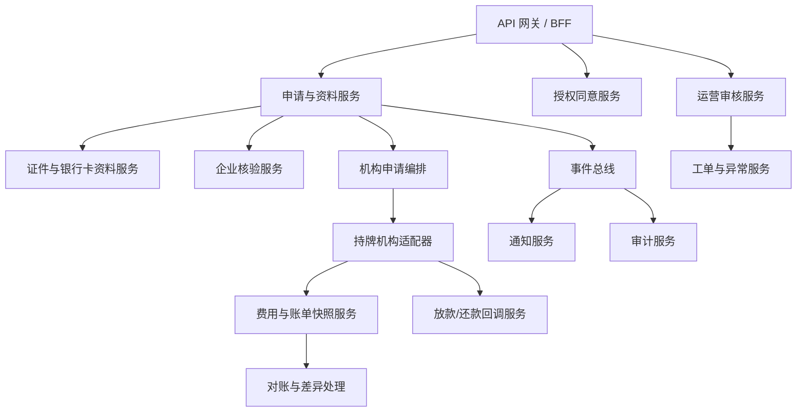
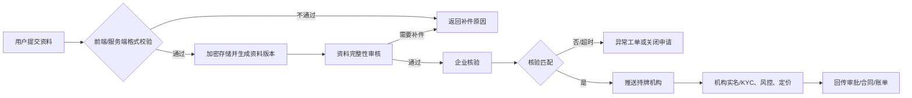

# 助贷平台后端规划（V1）

## 1. 定位与职责

助贷平台后端是申请资料、企业核验、机构接口、状态通知和运营协同的编排中枢；它不是放款主体，也不持有资金。

**权威数据源**：

| 数据                                     | 权威来源           | 助贷平台职责               |
| ---------------------------------------- | ------------------ | -------------------------- |
| 用户申请资料、授权记录                   | 助贷平台           | 加密存储、校验、流转、审计 |
| 员工在职/薪资核验结论                    | 签约企业           | 接收、版本化、转交机构     |
| 审批、额度、利率、费用、合同、放款、账单 | 持牌机构           | 接收并展示，不修改机构结果 |
| 支付结果/还款流水                        | 机构或合规支付通道 | 回调验签、对账、展示状态   |

## 2. 后端服务拆分



| 服务                 | 主要职责                                 | P0 能力                                          |
| -------------------- | ---------------------------------------- | ------------------------------------------------ |
| 申请与资料服务       | 维护申请状态机、必填校验、资料版本       | 创建草稿、提交、补件、撤回、超时关闭             |
| 证件与银行卡资料服务 | 接收身份证照片、证件号、银行卡号         | 病毒/文件格式检查、加密存储、脱敏、短时访问授权  |
| 授权同意服务         | 管理数据处理和企业核验授权               | 授权版本、字段范围、用途、有效期、撤回记录       |
| 企业核验服务         | 分派企业端核验任务并接收结论             | 单笔/批量核验、超时提醒、异议回退                |
| 运营审核服务         | 做资料完整性与真实性初筛，不做授信       | 队列、SLA、双人复核、补件模板、操作留痕          |
| 机构申请编排         | 向持牌机构提交与补传资料                 | 字段映射、幂等、重试、回调验签、状态归一化       |
| 费用与账单快照服务   | 展示机构返回的费用/还款计划              | 审批报价快照、合同前复核、账单同步、版本差异记录 |
| 助贷服务收费服务     | 管理助贷服务费、手续费的规则、审批与结算 | 费率配置、版本审批、适用校验、披露单、应收与凭证 |
| 放款/还款回调服务    | 接收机构或支付通道结果                   | 放款状态、账单状态、退款/冲正、异常队列          |
| 对账与差异处理       | 校验机构结果与本平台展示结果             | 日对账、差异工单、人工确认、不可直接改账         |
| 通知与工单           | 发送状态通知并承接客服/投诉              | Telegram 通知、敏感信息隐藏、投诉分派            |

## 3. 资料提交与审核流程



### 审核规则与权限

1. **机器校验**：文件大小/格式/清晰度、证件号码格式、银行卡号格式、重复申请、资料有效期。
2. **人工审核**：仅判断资料是否齐全、图片是否可读、字段是否矛盾；不得人工决定额度、利率或批准/拒绝贷款。
3. **双人复核**：修改银行卡、重传证件、解除高风险拦截等敏感操作，需要复核人确认。
4. **最小可见性**：运营列表显示姓名、证件号、银行卡号均脱敏；查看原件要有用途、权限、时效和审计日志。
5. **可解释补件**：输出具体缺失或不清晰字段，不输出反欺诈策略和机构风控规则。

## 4. 费用、利息与手续费模型

### 4.1 费用归属

| 项目              | 定价/收取主体                      | 平台处理方式                                                 |
| ----------------- | ---------------------------------- | ------------------------------------------------------------ |
| 利息              | 持牌机构                           | 接收机构报价和账单；展示 APR、总利息、每期本金/利息          |
| 机构手续费/服务费 | 持牌机构或合同明确主体             | 必须在审批报价、合同及账单逐项展示；不可隐藏在到账金额差额中 |
| 助贷服务费        | 仅在法律许可、合同明确且用户同意时 | 独立费用项、独立收款主体与凭证；否则平台不计收               |
| 逾期费用/违约金   | 持牌机构                           | 机构回传后展示，不由助贷侧自行计算或变更                     |
| 支付渠道费        | 合规支付通道/约定主体              | 作为对账项；如由用户承担，必须预先明示                       |

### 4.2 报价快照数据模型

每个审批报价建立不可变版本 `offer_snapshot`，包含：

```text
application_id, lender_offer_id, currency, principal,
term_count, repayment_frequency, disbursement_deduction_mode,
interest_basis, repayment_method, nominal_rate, apr,
interest_total, lender_fee_total, broker_service_fee_total,
payment_channel_fee_total, disbursed_amount, repayment_total,
schedule[], effective_at, expires_at, contract_version, source_payload_hash
```

规则：

- 用户签约前，显示“借款本金、实际到账金额、总还款额、每期应还、各费用项、APR、还款日期”。
- 报价必须标记是否存在放款扣费，以及采用按剩余本金摊还还是固定利息平摊；不得把预扣项目隐藏在到账金额差额中。
- 平台只保存和呈现持牌机构签名/验签通过的报价；不得用前端估算值替代合同或账单。
- 报价变更、手续费变更、还款计划变更都新建快照并要求用户重新确认。
- 金额用最小货币单位存储，禁止浮点数；金额、币种、税费规则均随快照冻结。

### 4.3 账单与对账

1. 回调接收机构生成的账单、放款、还款、冲正事件，并按 `lender_event_id` 幂等入库。
2. 每日按申请号、合同号、币种、期次、本金、利息、费用、实收金额逐项对账。
3. 差异自动建工单并暂缓展示“已结清”等最终状态；只能由机构确认后更正。
4. 用户端展示账单来自 `lender_bill_snapshot`，保留来源时间和版本；客服不能直接改账。

### 4.4 助贷服务费与手续费配置

助贷平台可配置独立于机构利息的服务费、手续费。配置并不代表某项收费可直接生效：每一规则须完成当地法律、税务、持牌机构合作协议及用户披露审核后，才可进入可售产品。

| 配置字段                      | 示例说明                                                    |
| ----------------------------- | ----------------------------------------------------------- |
| `fee_code` / `fee_name`       | 服务费、资料处理费等唯一编码与用户可见名称                  |
| `charging_entity`             | 助贷公司法定主体、收款账户、税务主体                        |
| `calculation_method`          | 固定额、按本金比例、阶梯金额；禁止以未审核的隐性规则计算    |
| `rate_or_amount` / `currency` | 费率/金额和币种，金额使用最小货币单位                       |
| `product_scope`               | 机构、产品、企业、渠道、金额区间、期限、地区、生效时间      |
| `collection_time`             | 签约前、签约时、放款后或周期性服务节点；必须与合同/披露一致 |
| `disclosure_text_version`     | 中文、英文、高棉语的费用说明版本与用户确认记录              |
| `approval_status`             | 草稿、法务审核、机构确认、已发布、已停用、已失效            |
| `tax_rule` / `invoice_rule`   | 税务规则、开票主体、凭证模板与会计科目                      |

**发布控制**：配置员只能创建草稿；合规/法务审核费用性质和披露；财务审核税务与收款主体；授权发布人发布。已生效报价不可被覆盖，任何变更新建版本并设置生效时间。

**用户披露**：申请报价页、签约前确认页、合同/服务协议、放款前确认和账单/收据均显示费用名称、金额/算法、收取主体、收取时间、是否可退及投诉入口。用户确认的费用版本写入申请快照。

## 5. 核心数据实体

| 实体                   | 关键字段                                                      |
| ---------------------- | ------------------------------------------------------------- |
| `application`          | 申请号、用户 ID、企业 ID、产品 ID、状态、机构申请号、状态版本 |
| `application_document` | 类型、加密存储键、哈希、资料版本、审核状态、有效期            |
| `bank_account`         | 加密卡号、脱敏卡号、持有人校验状态、绑定状态                  |
| `consent`              | 授权版本、字段范围、用途、接收方、有效期、撤回时间            |
| `verification`         | 企业核验结论、来源、核验人、时间、证据摘要                    |
| `review_case`          | 队列、审核原因、处理人、复核人、SLA、操作历史                 |
| `offer_snapshot`       | 机构报价的完整不可变快照                                      |
| `broker_fee_rule`      | 助贷服务费/手续费规则、适用范围、版本、审批与披露文本         |
| `broker_fee_snapshot`  | 某申请适用的服务费快照、用户确认、收款/退款状态               |
| `repayment_schedule`   | 期次、应还日期、本金、利息、费用、状态、来源版本              |
| `reconciliation_case`  | 对账日、差异类型、金额、机构流水、处理状态                    |
| `audit_event`          | 操作人、角色、请求 ID、前后状态、用途、时间                   |

## 6. 运营后台页面

| 页面         | 主要内容                                            | 权限                               |
| ------------ | --------------------------------------------------- | ---------------------------------- |
| 申请队列     | 待补件、待审核、待企业核验、待机构回传              | 审核员                             |
| 申请详情     | 脱敏身份资料、资料版本、流程时间线、授权记录        | 审核员/复核员                      |
| 审核工单     | 审核结论、补件模板、复核动作、SLA                   | 审核员/主管                        |
| 机构对账     | 放款、账单、还款、冲正、差异工单                    | 财务运营/主管                      |
| 费用配置     | 产品展示文案、机构费率模板版本、有效期              | 受限管理员；禁止直接覆盖已生效报价 |
| 助贷收费配置 | 服务费/手续费规则、审批流、披露文本、税务与开票设置 | 配置、合规、财务、发布四权分离     |
| 审计检索     | 原件访问、敏感操作、权限变化、接口回调              | 合规/审计                          |

## 7. 接口建议

| 接口                                       | 用途                           |
| ------------------------------------------ | ------------------------------ |
| `POST /v1/applications/{id}/documents`     | 上传身份证照片等资料，创建版本 |
| `POST /v1/applications/{id}/bank-accounts` | 绑定本人银行卡并触发校验       |
| `POST /v1/applications/{id}/submit`        | 校验完整性后提交申请           |
| `POST /v1/review-cases/{id}/decision`      | 运营资料审核 / 补件 / 复核     |
| `POST /v1/lenders/webhooks/offer`          | 接收机构审批报价和合同信息     |
| `POST /v1/lenders/webhooks/bills`          | 接收机构账单与还款状态         |
| `POST /v1/reconciliations/run`             | 发起受权限控制的对账任务       |
| `GET /v1/applications/{id}/disclosure`     | 返回用户签约前费用披露快照     |

## 8. V1 上线清单

- 一家持牌机构的申请、报价、合同、放款、账单回调全部联调完成。
- 身份证、银行卡资料的加密、脱敏、访问审计和删除/保留策略验证完成。
- 资料审核、补件、企业核验超时、机构回调失败、对账差异均有可演练 SOP。
- 用户确认页可展示机构确认的总成本与每期还款计划，且与合同数据一致。
- 由适用地区的法务、持牌机构及合规团队审核服务费、营销、授权文本、数据处理和催收流程后再上线。
