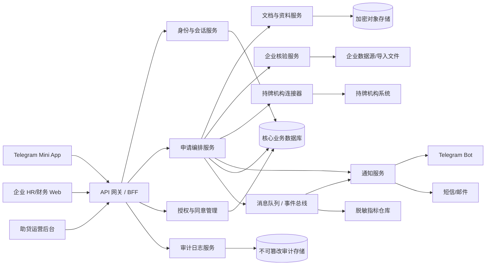

# 薪资贷系统架构（V1）

## 服务职责

| 层级   | 组件                                        | 职责                                       |
| ------ | ------------------------------------------- | ------------------------------------------ |
| 接入层 | Mini App、企业 Web、运营后台、API 网关      | 身份校验、限流、版本路由、统一错误码       |
| 业务层 | 申请编排、授权管理、企业核验、文档、通知    | 状态机、任务分发、授权校验、最小化数据处理 |
| 集成层 | 持牌机构连接器、支付/签约连接器、消息适配器 | 签名、幂等、重试、回调验签、对账           |
| 数据层 | 业务库、对象存储、审计库、指标仓库          | 加密、隔离、生命周期与脱敏                 |

## 安全与可靠性基线

- Telegram `initData` 必须在服务端验签，并以 Telegram 授权作为 Mini App 的唯一登录方式；不得把 Telegram 用户 ID 当作信贷实名身份凭据。
- 客户端使用 i18n 资源包按 Telegram `language_code` 选择高棉语、英语或简体中文，并允许用户覆盖；合同、授权书和错误码文案使用可版本追溯的机构确认译文。
- 敏感字段传输使用 TLS，存储加密并实行密钥轮换；运营和企业端按角色与企业租户隔离。
- 资料链接使用短时签名 URL；证件和工资类文件禁止公开桶访问。
- 身份证照片、证件号码与银行卡号应分级加密存储、字段级脱敏和最小权限访问；禁止把原件放入日志、埋点、通知或客服工单正文。
- 外部回调需双向认证/签名验证、幂等键、指数退避重试与死信队列。
- 申请、授权、企业核验、机构决策、合同和放款均采用不可逆流水号与审计事件关联。
- 关键监控：接口成功率、回调积压、核验超时、签约失败、放款对账差异、异常访问与权限变更。

## 建议接口（概念）

| 接口                                | 方法 | 用途             |
| ----------------------------------- | ---- | ---------------- |
| `/v1/applications`                  | POST | 创建/提交申请    |
| `/v1/consents`                      | POST | 记录字段级授权   |
| `/v1/verifications/employment`      | POST | 发起企业核验     |
| `/v1/lenders/decisions/webhook`     | POST | 接收机构审批回调 |
| `/v1/lenders/disbursements/webhook` | POST | 接收放款回调     |
| `/v1/applications/{id}/timeline`    | GET  | 用户查看进度     |
