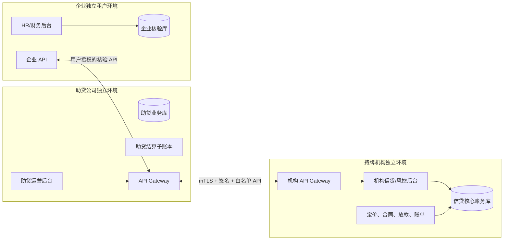
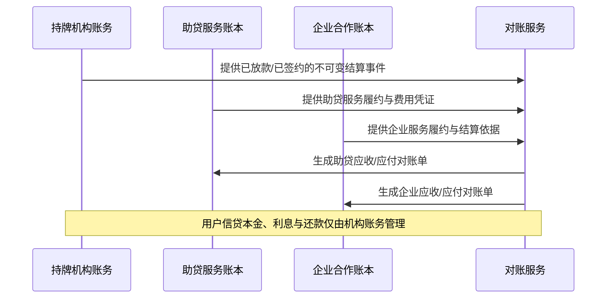

# 柬埔寨合规隔离与结算架构

## 合规前提

本架构不将助贷服务费、手续费或任何其他收费设计为规避利率上限或隐匿实际借款成本的手段。每一项用户收费均须由当地持牌机构、柬埔寨法律顾问及适用监管要求确认其法律性质、允许性、计价方式、收取主体、税务处理和披露方式。

## 1. 物理隔离架构

### 强制隔离要求

| 域       | 必须隔离                                                          | 允许交换                                                             |
| -------- | ----------------------------------------------------------------- | -------------------------------------------------------------------- |
| 助贷公司 | 云账号/VPC、数据库、密钥、身份域、日志、财务账本、管理员          | 申请摘要、授权凭证、企业核验结论、机构对外状态、经确认的费用披露快照 |
| 持牌机构 | 云账号/VPC、信贷核心、风控特征库、模型、合同/账务库、密钥、管理员 | 对外审批状态、用户可见原因码、报价/账单/放款回调、对账文件           |
| 企业     | 企业租户、员工主数据、HR/财务权限、导入文件、日志                 | 仅限已授权员工的在职/薪资核验结论与核验时间                          |

禁止事项：共享生产数据库账号、跨域直接读库、共用管理员、以共享文件夹传递身份证或银行卡原件、在日志/IM 中传输敏感资料。

## 2. API 对接契约

1. 每个 API 使用独立客户端证书、`mTLS`、请求签名、时间戳、幂等键及 IP 白名单。
2. 助贷→机构：只发送申请、授权和必要的资料引用；资料原件通过短时、单用途、可审计的受控对象访问交付。
3. 机构→助贷：只回传用户可展示的状态、报价披露快照、合同链接、放款/账单状态及对账流水；不回传模型特征、内部风险分或策略细节。
4. 企业→助贷：只回传授权范围内的在职/薪资核验结论；不得回传全量 HR 档案或与申请无关的工资资料。
5. 各方保存自己的原始账务与审计记录；API 事件采用事件 ID、来源哈希、版本号和签收状态进行可追溯对账。

## 3. 三套独立财务结算

| 账本         | 所有者   | 记录内容                                                             | 不应记录                         |
| ------------ | -------- | -------------------------------------------------------------------- | -------------------------------- |
| 机构信贷账本 | 持牌机构 | 本金、利息、合规费用、放款、应收、还款、冲正、逾期                   | 助贷内部佣金或企业分成规则       |
| 助贷服务账本 | 助贷公司 | 经批准的服务费、手续费、渠道/企业服务结算、应收应付、税费、发票/凭证 | 贷款本金、利息应收、用户还款资金 |
| 企业合作账本 | 企业     | 企业应收/应付的合作分成、服务结算、税费、对账单                      | 员工个人贷款账单、利息、逾期明细 |

### 可审计结算流

企业分成只能基于经批准、可证明的企业服务或合作合同，并应完成合规、税务、利益冲突和用户披露审查。不得使企业分成与对特定员工的信贷批准、定价、催收或人事处置挂钩。

## 4. 费用治理

### 用户费用披露

用户签约前必须从机构的不可变报价快照中看到：本金、年利率、APR/总成本口径（按适用规则）、每一项费用、实际到账金额、总还款额、期数、每期还款日，以及各收费主体。

### 费用审批矩阵

| 费用              | 业务提出         | 合规/法务审核                        | 最终生效者           | 用户展示来源               |
| ----------------- | ---------------- | ------------------------------------ | -------------------- | -------------------------- |
| 利息              | 持牌机构产品团队 | 机构合规                             | 持牌机构授权人       | 机构报价/合同              |
| 机构收费          | 持牌机构产品团队 | 机构合规及法律意见                   | 持牌机构授权人       | 机构报价/合同              |
| 助贷服务费        | 助贷公司         | 双方合规、当地法律意见、机构书面确认 | 机构与助贷双方授权人 | 机构确认的统一费用披露     |
| 企业服务结算/分成 | 商务合作方       | 双方合规、税务、利益冲突审查         | 双方授权人           | 对用户有影响时在签约前披露 |

任何费用都不得在放款到账金额中“静默扣除”、拆分为规避性项目，或在机构报价快照之外收取。

### 助贷收费后台规则

助贷平台后台可维护服务费与手续费的规则、适用产品、金额/费率、收款时点、收费主体、税务与多语言披露文本。配置必须经过业务、合规/法务、财务和发布人四权分离审批；每笔申请冻结适用规则与用户确认版本，结算与退款均在助贷独立子账本完成。

## 5. 风控与利益冲突隔离

- 助贷平台和企业均不能配置、覆盖或影响持牌机构的风控规则、模型、额度、利率、拒绝理由或贷后策略。
- 持牌机构的风控后台与助贷运营后台使用不同的身份提供方、管理员、密钥和审计域；仅通过版本化 API 交互。
- 企业端不可访问贷款金额、利率、还款、逾期或风控信息；机构端不可访问超出授权范围的 HR 数据。
- 企业收入分成、助贷渠道激励、风控审批人员绩效之间要建立冲突检查和审批屏障。

## 6. 上线门槛

1. 完成独立云环境、网络分段、密钥管理、身份域和日志保留验证。
2. API 完成 mTLS、签名验签、幂等、权限范围、重放防护、渗透测试和故障降级演练。
3. 三方账本可逐笔对账，且未经授权的角色无法访问其他方原始账务或敏感资料。
4. 全部费用及企业分成取得书面法律/合规意见，并在用户旅程中完成适用的预先披露和确认。
5. 将本文件与持牌机构的产品批准、合同文本、费用表、催收规则和投诉机制一起提交最终合规评审。
