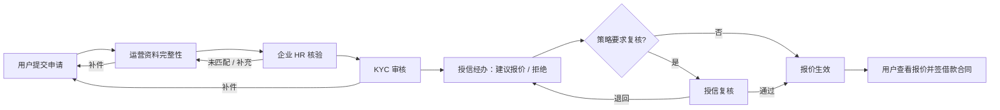
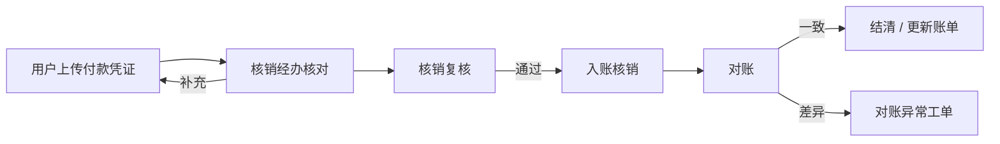

# KhmerX × PayEase V1：管理端功能与审批流规格

> **用途**：Trae 实现助贷运营端、企业端、合作金融机构端，以及共享审批工作流。
> **原则**：审批不是简单的“同意 / 拒绝”按钮；每一步必须有角色、动作、原因、输入快照、时间、幂等键和 append-only 审计事件。

## 1. 四端职责与入口

| 端         | 产品名称            | 核心职责                                             | 明确禁止                                       |
| ---------- | ------------------- | ---------------------------------------------------- | ---------------------------------------------- |
| 个人端     | PayEase · by KhmerX | 申请、签约、账单、还款凭证、客服                     | 授信决定、放款、核销终审                       |
| 助贷运营端 | KhmerX Operations   | 资料完整性、补件、企业催办、客服、投诉协同、对账工单 | 授信、定价、合同终签、放款决定                 |
| 企业端     | KhmerX Enterprise   | 员工在职/薪资核验、企业待办                          | 证件、联系人、合同、额度、账单、逾期、风控结论 |
| 机构端     | KhmerX Partner      | KYC、审批、报价、合同、放款、核销、最终投诉          | 跨机构或跨企业租户数据                         |

## 2. 组织、账号、角色与数据范围

### 2.1 组织模型

```text
Institution tenant
└─ Department
   └─ Role
      └─ User account
         └─ Scope policy (tenant / department / queue / field visibility)
```

- V1 由平台管理员人工维护部门、角色、账号与范围；删除采用停用，不删历史审计。
- 初始角色名称可由合作机构自行创建；系统提供模板角色，不强制兰海国际的最终组织名称。
- 每个权限由 `resource + action + scope + fieldPolicy` 定义。默认拒绝；字段权限不得只依赖前端隐藏。

### 2.2 初始模板角色

| 端                | 角色            | 权限摘要                                         |
| ----------------- | --------------- | ------------------------------------------------ |
| KhmerX Operations | 平台管理员      | 维护本端账号、角色、队列；不可修改机构授信结论   |
| KhmerX Operations | 资料审核员      | 完整性检查、发起补件、提交给 HR；不可审批额度    |
| KhmerX Operations | 运营主管        | 分派队列、升级异常、查看审计；不可越权放款       |
| KhmerX Operations | 客服 / 投诉专员 | 工单与受控信息查询；不能查看不相关证件和风控资料 |
| KhmerX Enterprise | 企业管理员      | 维护本企业 HR 账号、查看本企业任务统计           |
| KhmerX Enterprise | HR 核验员       | 本企业 MATCHED / NOT_MATCHED、薪资区间核验       |
| KhmerX Partner    | 机构管理员      | 维护本机构部门、角色、账号与策略版本             |
| KhmerX Partner    | KYC 审核员      | 审核资料、补件、提交审批建议                     |
| KhmerX Partner    | 授信经办        | 创建拒绝 / 报价建议，不能自行生效最终放款        |
| KhmerX Partner    | 授信复核员      | 按审批策略复核；同人隔离                         |
| KhmerX Partner    | 合同审核员      | 审核合同签署完整性、退回补充                     |
| KhmerX Partner    | 放款经办        | 创建人工放款指令                                 |
| KhmerX Partner    | 放款复核员      | 批准 / 拒绝放款指令；不得复核自己创建的指令      |
| KhmerX Partner    | 核销经办        | 核对凭证、创建核销建议                           |
| KhmerX Partner    | 核销复核员      | 最终核销 / 退回；不得与经办同人                  |
| KhmerX Partner    | 投诉负责人      | 最终处理合同、放款、催收类投诉                   |
| 全端              | 审计查看者      | 只读审计与脱敏业务快照                           |

## 3. 审批引擎通用模型

每个审批对象（申请、报价、合同、放款、核销、投诉）共享下列字段：

```text
approval_case_id
aggregate_type + aggregate_id
workflow_definition_version
current_step + status
assigned_department_id / assigned_role_id / assignee_id
action (APPROVE / REJECT / RETURN / REQUEST_SUPPLEMENT / ESCALATE / CANCEL)
reason_code + reason_note
input_snapshot_hash
idempotency_key
created_at / acted_at
actor_id / actor_role_snapshot
audit_event_id
```

规则：

1. 只有当前被授权角色可执行当前 step；所有非法迁移返回 403 / 409。
2. 每个可写动作要求幂等键；重复提交返回原始结果，不能二次创建放款或账单。
3. `maker-checker`：放款、核销、模板发布、产品规则发布、关键手工调整必须同人隔离。
4. 拒绝、退回、补件、取消必须选择 `reason_code`；用户端仅映射为可行动中性提示。
5. 审批动作写入 append-only 事件；审计表不可 UPDATE / DELETE。
6. 阈值策略版本化。V1 USD 10–500 可按单层审批，但引擎支持“金额 >= X 增加复核层”。

## 4. 申请至额度的审批流



### 4.1 状态机

| 阶段        | 内部状态                        | 可执行人                | 用户可见状态     |
| ----------- | ------------------------------- | ----------------------- | ---------------- |
| 提交        | `SUBMITTED`                     | 系统                    | 已提交           |
| 资料检查    | `BROKER_REVIEW`                 | 资料审核员              | 资料核对中       |
| 补件        | `SUPPLEMENT_REQUIRED`           | 资料审核员 / KYC 审核员 | 需要补充资料     |
| 企业核验    | `EMPLOYER_VERIFICATION_PENDING` | 企业 HR                 | 企业信息核验中   |
| KYC         | `LENDER_KYC_REVIEW`             | KYC 审核员              | 审核中           |
| 授信建议    | `CREDIT_MAKER_REVIEW`           | 授信经办                | 审核中           |
| 复核        | `CREDIT_CHECKER_REVIEW`         | 授信复核员              | 审核中           |
| 已报价      | `OFFERED`                       | 系统                    | 已获得审核结果   |
| 拒绝 / 关闭 | `REJECTED` / `CLOSED`           | 机构授权角色            | 暂不符合当前条件 |

### 4.2 HR 提醒 SLA

- 创建任务即通知；12 小时提醒核验员；24 小时升级企业管理员；48 小时创建运营异常工单。
- 所有提醒按 `application_id + reminder_level` 幂等；用户端不显示 HR 人员资料。

## 5. 报价、双合同与签署审批

### 5.1 报价创建与生效

授信经办仅创建**报价建议**。报价需固化：批准金额、15 / 30 天、年息、服务费、实际到账、应还、到期日、产品规则版本、合同模板版本、有效期（默认 7 天）。

- 策略不要求复核：经办授权后 `OFFERED`。
- 策略要求复核：复核通过后才 `OFFERED`。
- 历史报价是快照；产品规则后续变更不得修改它。

### 5.2 合同工作流

| 合同                | 触发       | 审批 / 签署                    | 完成条件       |
| ------------------- | ---------- | ------------------------------ | -------------- |
| 服务协议 / 数据授权 | 申请提交前 | 用户确认；版本由已发布模板提供 | 可提交申请     |
| 借款合同            | 有效报价后 | 用户签署 → 合同审核员检查证据  | 可进入放款审批 |

- 模板管理流：`DRAFT → LEGAL_REVIEW → BUSINESS_APPROVAL → PUBLISHED → RETIRED`，模板发布采用双人复核与版本冻结。
- 合同签署、撤销、重签均要产生证据和审计事件；前端不得伪造 `SIGNED`。

## 6. 人工放款审批流


| 状态                         | 允许角色    | 规则                                    |
| ---------------------------- | ----------- | --------------------------------------- |
| `DISBURSEMENT_DRAFT`         | 放款经办    | 读取脱敏收款账户，创建指令              |
| `DISBURSEMENT_PENDING_CHECK` | 放款复核员  | 不得由创建人复核                        |
| `DISBURSEMENT_APPROVED`      | 系统 / 经办 | 可线下执行，不代表已到账                |
| `DISBURSEMENT_EXECUTING`     | 放款经办    | 登记外部参考号 / 失败原因（敏感值脱敏） |
| `DISBURSED`                  | 放款复核员  | 二次确认后才生成账单                    |
| `DISBURSEMENT_FAILED`        | 放款复核员  | 可退回重建或关闭，完整审计              |

## 7. 人工还款核销与对账审批流



- 用户上传后状态为 `PAYMENT_PROOF_SUBMITTED`；不可直接 `SETTLED`。
- 核销经办创建建议，核销复核员最终确认；同人隔离。
- 差异只能创建工单 / 调整建议，禁止直接 UPDATE 历史账本抵消。
- 已结清后禁止回退为已放款；任何更正使用带原因和双人复核的 `manual_adjustment`。

## 8. 管理端页面清单

### 8.1 KhmerX Operations

```text
运营首页 / 待办队列 / 申请资料核对 / 补件管理 / 企业核验催办
异常工单 / 客服与投诉协同 / 对账异常 / 审计查询 / 本端账号与角色
```

### 8.2 KhmerX Enterprise

```text
企业首页 / HR 核验待办 / 单笔核验 / 批量核验导入
核验历史 / 异议处理 / 企业账号与角色 / 通知记录
```

### 8.3 KhmerX Partner

```text
机构工作台 / KYC 队列 / 授信与报价队列 / 复核队列
合同与模板 / 放款队列 / 核销队列 / 账单与对账 / 投诉终审
组织与账号 / 角色与字段权限 / 产品规则版本 / 审计中心
```

每个列表页面固定具备：范围过滤、状态过滤、分配 / 领取、SLA 时间、最小必要字段、审计入口；批量动作必须二次确认、权限检查和结果明细。

## 9. 必测权限与审批场景

- [ ] 运营资料审核员不能批准报价、放款、核销。
- [ ] 企业 HR 不能查看任何合同、额度、账单、联系人、证件或其他工厂任务。
- [ ] 授信经办与复核不能为同一账号；放款、核销同样隔离。
- [ ] 无授权角色对任意审批动作返回 403；状态冲突返回 409。
- [ ] 同一个幂等键的放款 / 核销请求不会重复执行。
- [ ] 拒绝 / 补件 / 退回有原因代码和脱敏用户提示。
- [ ] 合同、报价、产品规则、审计事件历史不可改写。
- [ ] 组织 / 角色 / 字段范围变更可追溯，停用账号后立刻失去新操作权限。
